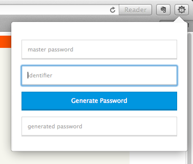

makePassword
=============

Storage less password manager, simple generator based on SHA. No third party libraries used, pure JS. 

###[Latest release download](https://github.com/jacekd/makePassword/releases/tag/1.1)

_screenshots_:

 

I've been using similar approach to password for the last few years. The extensions are direct clone of a website I was using hosted under [tools.jacekdominiak.com](http://tools.jacekdominiak.com). 

In a short, what you need to follow is:

1. remember and use your master password

2. identified can be email address or website url. I strongly recommend changing one character (like first or last) to something else, which makes the encryption much easier to crack. 

3. Hit [enter] or [Generate Password] then simply copy the password. 

==========
Changelog:
####1.1(https://github.com/jacekd/makePassword/releases/tag/1.1)
- generated password cleans itself upon closure of the pop-up window

####1.0(https://github.com/jacekd/makePassword/releases/tag/1.0)
- autoselect generated password upon enter
- autoselect master password upon open
- new icon
- fairly stable [based on 